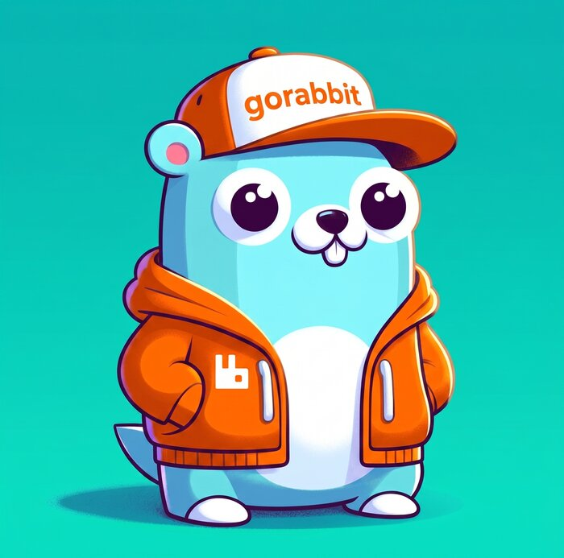

# gorabbit

<p align="center">
 <b>A typed, resilient RabbitMQ pub/sub client for Go — topic exchanges, retries, dead-letter queue and offline caching</b><br>
  <br>
    <a href="https://github.com/diegoclair/gorabbit/tags" alt="GitHub tag">
     
    </a>
    <a href='https://coveralls.io/github/diegoclair/gorabbit?branch=main'>
     
    </a>
    <a href="https://github.com/diegoclair/gorabbit/actions">
     
    </a>
    <a href="https://opensource.org/licenses/MIT">
     
    </a>
    <a href='https://goreportcard.com/badge/github.com/diegoclair/gorabbit'>
     
    </a>
</p>

Publish and consume typed messages over RabbitMQ topic exchanges. Each message
type is its own routing key, handlers are generic (`func(ctx, OrderCreated) error`),
and the topology — exchanges, queue, retry queue and dead-letter queue — is
declared for you on connect.

The only third-party dependency is
[`amqp091-go`](https://github.com/rabbitmq/amqp091-go). Logging, context
propagation and the cache are interfaces you implement, so the library stays
uncoupled from your application.

## Install

```sh
go get github.com/diegoclair/gorabbit
```

Requires **Go 1.27+**.

## Quickstart

One package per exchange, shared by the services that publish and consume it: the
marker names the exchange, the alias is what every message embeds, and the facts
live next to them. A message therefore carries its own destination — `Publish`
takes no exchange, and the routing key is the struct's type name.

```go
// package orders
type Exchange struct{}

func (Exchange) Name() string { return "orders" }

type msg = gorabbit.Msg[Exchange] // unexported alias: the plumbing stays out of sight

type OrderCreated struct {
    msg
    OrderID string `json:"order_id"`
    Total   int64  `json:"total"`
}
```

Embedding `gorabbit.Msg[Exchange]` directly works too; the only difference is that
the `Msg` field then shows up on the message for whoever imports it. Either way
the marker has no fields and no exported methods, so it adds nothing to the JSON
payload: `{"order_id":"123","total":4990}`.

A struct without a marker is not a `gorabbit.Message` and does not compile — the
mistake is caught by the compiler, never by the broker.

### A service owns one exchange and consumes others

The exchange a service owns is a type parameter of its client, so it is named
once, at the composition root. That client publishes the facts of that exchange
and consumes facts from any other.

```go
client, err := rabbitmq.NewSetup[orders.Exchange](amqpURL, "order-service").
    WithConsumer("order-service").             // queue name
    WithRetry(3, 30*time.Second, isRetryable). // retries before the DLQ
    WithPrefetchCount(10).
    Connect(gorabbit.NewMemoryCache())
if err != nil {
    log.Fatal(err)
}
defer client.Close()

// Consuming a fact owned by another service.
err = rabbitmq.RegisterHandler(ctx, client, payments.PaymentConfirmed{},
    func(ctx context.Context, msg payments.PaymentConfirmed) error {
        return orderService.MarkPaid(ctx, msg.OrderID)
    })
if err != nil {
    log.Fatal(err)
}

client.Start(ctx) // call after every handler is registered

// Publishing the fact this service owns.
err = client.Publish(ctx, orders.OrderCreated{OrderID: "123", Total: 4990})
```

`Publish` only accepts messages of the exchange the client owns:
`client.Publish(ctx, payments.PaymentConfirmed{})` does not compile, so a service
cannot forge another service's facts. `RegisterHandler` is deliberately free —
consuming what others publish is the point — and binds the queue to the exchange
owning the message, declaring it if that service has not started yet. Pointers
publish alike: `*OrderCreated` and `OrderCreated` share the exchange and the
routing key. A panic inside a handler is recovered and treated as a failure — it
never takes the consumer down.

Two message types may share a name — an `OrderCreated` in `orders` and another in
`billing` — and therefore a routing key. The exchange separates them: each binding
is `(exchange, routing key)`, and a message retried through the consumer's own
exchange carries its origin in the `x-origin-exchange` header, so it comes back to
the handler that owns it.

## Options

| Option | Effect |
| --- | --- |
| `WithConsumer(queue)` | Consume from `queue`; also declares `<queue>.dlq` and `<queue>.retry` |
| `WithRetry(count, interval, isRetryable)` | Retry failed messages before dead-lettering; `nil` retries every error |
| `WithPrefetchCount(n)` | Unacknowledged messages the broker delivers at once |
| `WithLogger(l)` | Structured logging (noop by default) |
| `WithHeaderCarrier(h)` | Propagate context values as message headers |
| `WithReconnectDelay(d)` | Wait between reconnection attempts (default 2s) |
| `WithDialTimeout(d)` | Bound each connection attempt (default: the amqp091 30s) |

## Design: a neutral port and a driver

The root package `gorabbit` holds the driver-neutral contracts — `Exchange`,
`Msg`, `Message`, `OwnedBy`, `Handler`, `Publisher`, `Consumer`, `Cache`,
`Logger`, `HeaderCarrier`. The `gorabbit/rabbitmq` subpackage is the RabbitMQ
driver and depends on those contracts, never the other way around.

Your domain code therefore imports only `gorabbit` (no AMQP types leak into it),
and the broker choice stays at the composition root:

```go
type Publisher[E Exchange] interface {
    Publish(ctx context.Context, msg OwnedBy[E]) error // *rabbitmq.Client[E] satisfies this
}
```

`Message` and `OwnedBy[E]` are satisfied only by embedding `Msg[E]`: the methods
it promotes are unexported, so nothing else can implement them and there is
nothing for application code to call. `Message` is any fact, whoever owns it;
`OwnedBy[E]` is a fact of the exchange `E`.

### What a message type may be

- A named struct, exported or not, embedding one marker. The routing key is the
  type name without the package.
- A pointer to one. `Publish(ctx, &OrderCreated{})` is the same message; a typed
  nil returns an error instead of panicking.
- Not a generic type: the routing key of `Envelope[Order]` is the instantiated
  name, brackets, dots and all. Wrap the payload in a plain struct instead.

The marker itself must be a value type with a value receiver (`type Orders
struct{}`), since it is resolved from its zero value.

## Retry and dead-letter

With `WithRetry`, a handler error republishes the message to `<queue>.retry`,
which holds it for the configured interval and then returns it to the queue. The
attempt is counted in the `x-retry-count` header; past the limit the message
moves to `<queue>.dlq`. Without `WithRetry`, a failed message is dead-lettered
right away.

## Offline caching

If RabbitMQ is unreachable, `Publish` stores the message in the `Cache` and
returns nil; cached messages are published — in order — on the next successful
connection. Each registered handler is also recorded there, so on the next start
bindings whose handler no longer exists in the code are unbound.

`gorabbit.NewMemoryCache()` is process-local and good enough for a single
instance; a shared store (Redis) is what makes cached messages and bindings
survive a restart.

```go
type Cache interface {
    Set(ctx context.Context, key string, data []byte, ttl time.Duration) error
    Get(ctx context.Context, key string) ([]byte, error)
    GetAllKeys(ctx context.Context, pattern string) ([]string, error)
    Delete(ctx context.Context, keys ...string) error
}
```

A `ttl` of zero means no expiration, `Get` returns `nil, nil` when the key is
absent, and `GetAllKeys` receives a glob pattern (`*` and `?`).

## Message id

Every published message carries a UUIDv7 `MessageId`, assigned before the message
reaches the cache and preserved across retries and into the dead-letter queue. The
same logical message therefore always carries the same id — which is what lets a
consumer discard a duplicate, since caching and replaying make delivery
at-least-once. It is also logged when a handler panics and when a message is
dead-lettered.

## Logging

```go
type Logger interface {
    Debug(ctx context.Context, msg string, keyvals ...any)
    Info(ctx context.Context, msg string, keyvals ...any)
    Warn(ctx context.Context, msg string, keyvals ...any)
    Error(ctx context.Context, msg string, keyvals ...any)
}
```

## Propagating context (correlation id, user, tenant)

The library does not know your context keys, so it asks you for them:

```go
type HeaderCarrier interface {
    FromContext(ctx context.Context) map[string]any
    ToContext(ctx context.Context, headers map[string]any) context.Context
}
```

`FromContext` is called when publishing and its values travel as AMQP headers;
`ToContext` is called before the handler runs, on the consumer side. Values must
be AMQP-encodable (string, int, bool, time.Time, ...).

```go
type correlationCarrier struct{}

func (correlationCarrier) FromContext(ctx context.Context) map[string]any {
    return map[string]any{"correlation_id": ctx.Value(correlationIDKey)}
}

func (correlationCarrier) ToContext(ctx context.Context, headers map[string]any) context.Context {
    id, _ := headers["correlation_id"].(string)
    if id == "" {
        id = uuid.NewV7().String()
    }
    return context.WithValue(ctx, correlationIDKey, id)
}
```

## Ordering

Ordering is not handled here: with more than one consumer on a queue, two
messages may be processed concurrently and out of order. Ordering requires Single
Active Consumer plus a partitioning key, which is an application decision.

## Testing

`go test ./...` starts a RabbitMQ container through
[testcontainers](https://golang.testcontainers.org/) for the integration tests,
so Docker must be running. `go test -short ./...` skips them and runs only the
unit tests.

## Contributing

**Contributions are welcomed. :)**

1. Fork the repository
2. Create a new feature branch (`git checkout -b feature/<FEATURE NAME>`)
3. Make the necessary changes
4. Commit your changes (`git commit -m "Add some feature"`)
5. Push your changes to your forked repository (`git push origin feature/<FEATURE NAME>`)
6. Create a pull request to the main branch of the repository

## License

gorabbit is [MIT licensed](./LICENSE).
